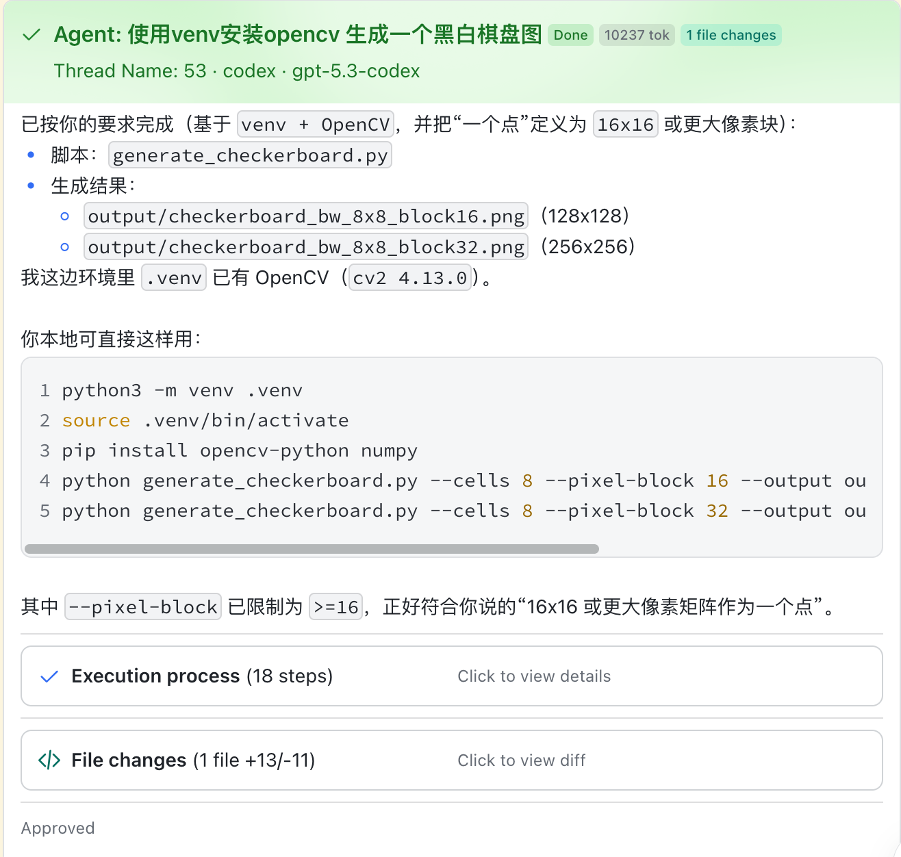
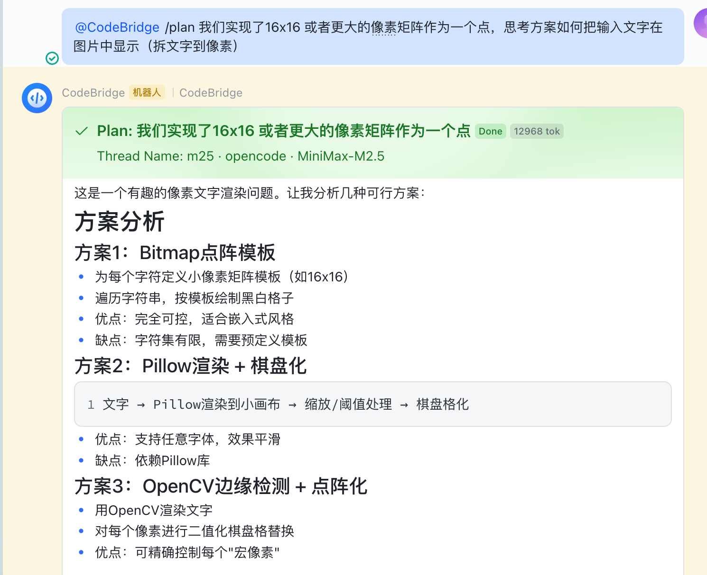
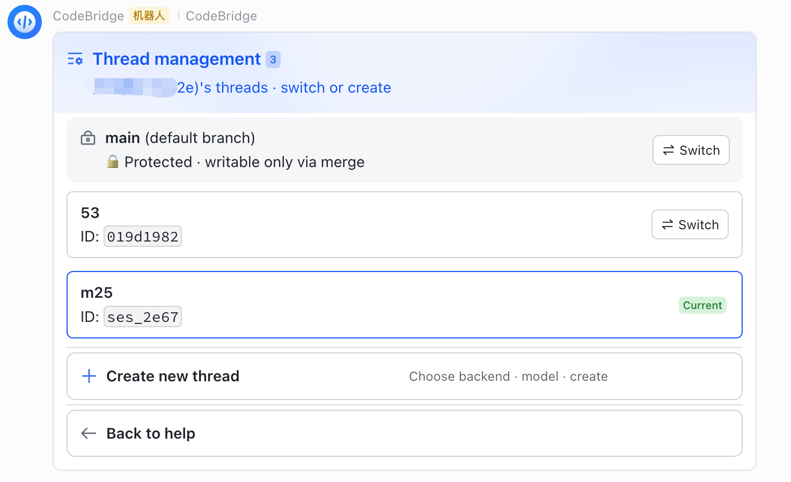
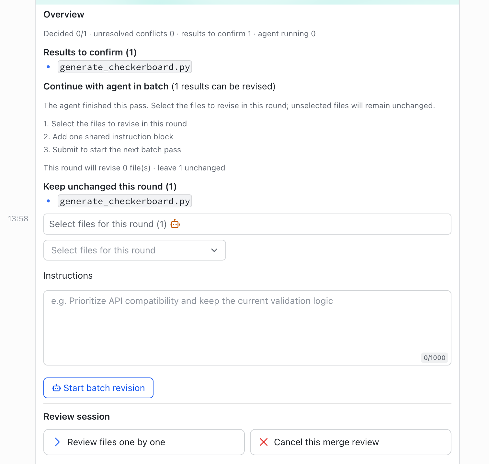
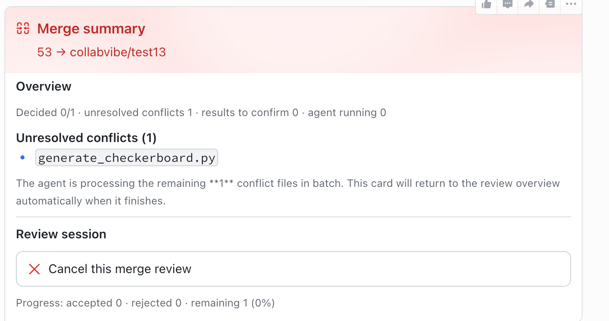

> 当前项目处于 DEV 阶段，功能与文档都可能随时变动，且整体尚未经充分验证，请谨慎使用。

  <h1>CollabVibe</h1>
  
连接即时通讯平台与 AI Agent 后端的协作式编程编排引擎。

  

    <a href="./README.md"><strong>中文</strong></a> |
    <a href="./README.en.md"><strong>English</strong></a>
  

## 为什么是 CollabVibe

- 协作是第一生产力，一起参与、阅读Vibe Coding的过程。而不是几千行的代码和一条AI自动生成的PR，这是对同事的霸凌。
- 多端支持，手机在手也能让Agent持续运行必要的计划步骤
- 统一管理多个backend，接入不同API Provider，团队可以根据成本和效果灵活切换

## 已支持 Backend

| Backend | Transport | 状态 | 说明 |
| --- | --- | --- | --- |
| **`codex`** | `codex` | ✅ 已支持 | 通过 Codex protocol / stdio 接入 |
| **`opencode`** | `acp` | ✅ 已支持 | 通过 ACP 接入 |
| **`claude-code`** | `acp` | ✅ 已支持 | 通过 ACP 接入 |
| **`gemini-cli`** | `TBD` | 🗺️ 规划中 | 当前代码未接入 |
| **`trae-cli`** | `TBD` | 🗺️ 规划中 | 当前代码未接入 |

## 已支持 IM 平台

| 平台 | 状态 | 当前能力 | 说明 |
| --- | --- | --- | --- |
| Feishu / Lark | ✅ 已支持 | 消息事件、卡片、Bot 菜单、流式输出 | 当前主平台 |
| Slack | 🚧 进行中 | 已有输出适配与 socket 基础能力 | 应用层主链路尚未接完 |
| MS Teams | 🗺️ 规划中 | 未接入 | 预留扩展方向 |

## 文档入口

- 默认文档： [简体中文](./docs/zh/index.md)
- 英文文档： [English](./docs/index.md)
- 架构入口： [系统架构](./docs/zh/01-architecture/architecture.md)

## Showcase

<table>
  <tr>
    <td align="center"> <b>Agent Turn 卡片</b></td>
    <td align="center"> <b>Plan 模式</b></td>
  </tr>
  <tr>
    <td align="center"> <b>多线程管理</b></td>
    <td align="center"> <b>Merge Review</b></td>
  </tr>
  <tr>
    <td colspan="2" align="center"> <b>冲突解决</b></td>
  </tr>
</table>

## 快速开始

👉 [查看快速开始指南](https://collab.vzxxbacq.me/zh/00-overview/quickstart)

## TODO

- [ ] 飞书平台代码优化，文件输入支持
- [ ] Slack 平台编写和测试
- [ ] `gemini-cli` 和 `trae-cli` 后端支持

## 说明

- 运行日志与本地数据目录默认不纳入 Git。
- 如果你要修改跨层数据流，请先阅读 `AGENTS.md`。
- 完整的产品、架构与运维文档位于 `docs/`。

## 许可证

Apache-2.0，详见 [LICENSE](./LICENSE)。
