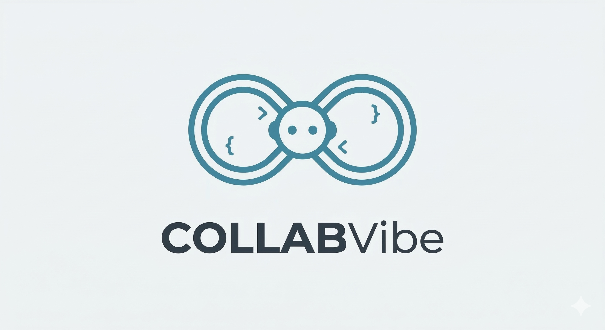
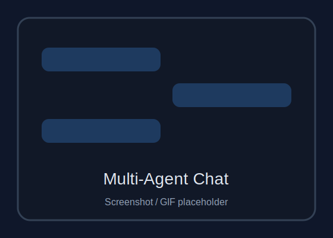
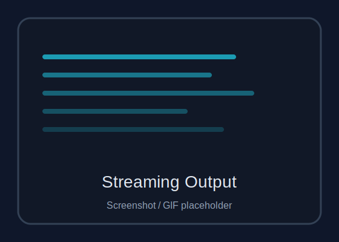
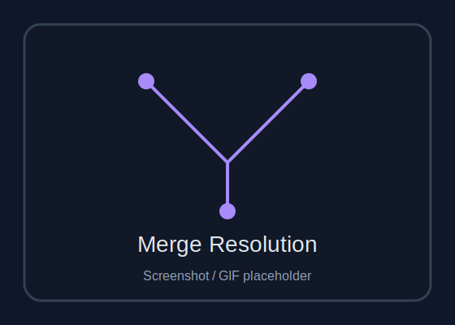

> This project is currently in the DEV stage. Features and documentation may change at any time, and the project remains unvalidated; use with caution.

<div align="center">
  
  <h1>CollabVibe</h1>
  <p>CollabVibe: Empowering teams to co-code with multi-agent AI via IM platforms.</p>
  <p>
    <a href="./README.md"><strong>English</strong></a> |
    <a href="./README.zh-CN.md"><strong>中文</strong></a>
  </p>
</div>

## Why CollabVibe

- Collaboration is the highest-leverage interface for getting real work done, and chat is where teams already coordinate.
- Human-in-the-loop turns agent execution from a risky automation toy into a compounding system.
- It builds on the permissions, reach, notification loops, and habits your organization already has inside workplace collaboration platforms.
- It unifies multiple models behind one operational surface so teams can make full use of existing accounts, providers, and budget pools.
- It keeps agent orchestration available across devices, so you can direct work effectively even when you are away from your computer.

## Supported Backends

| Backend | Transport | Status | Notes |
| --- | --- | --- | --- |
| **`codex`** | `codex` | ✅ Supported | Connected through the Codex protocol / stdio path |
| **`opencode`** | `acp` | ✅ Supported | Connected through ACP |
| **`claude-code`** | `acp` | ✅ Supported | Connected through ACP |
| **`gemini-cli`** | `TBD` | 🗺️ Planned | Not wired in the current codebase |
| **`trae-cli`** | `TBD` | 🗺️ Planned | Not wired in the current codebase |

## Supported IM Platforms

| Platform | Status | Current Capability | Notes |
| --- | --- | --- | --- |
| Feishu / Lark | ✅ Supported | Message events, cards, bot menu, streaming output | Current primary platform |
| Slack | 🚧 In progress | Output adapter and socket foundation exist | App-layer wiring is not complete yet |
| MS Teams | 🗺️ Planned | Not connected | Reserved as a future extension |


## Documentation

- Default docs: [English](./docs/index.md)
- 中文文档: [简体中文](./docs/zh/index.md)
- Architecture entry: [Execution Paths and Data Flow](./docs/01-architecture/data-paths.md)

## Quick Start

### 1. Install

```bash
npm install
```

### 2. Configure

```bash
cp .env.example .env
```

Recommended `.env` baseline:

```dotenv
FEISHU_APP_ID=cli_xxxxxxxxxx
FEISHU_APP_SECRET=xxxxxxxxxxxxxxxx

CODEX_APP_SERVER_CMD=codex app-server
COLLABVIBE_WORKSPACE_CWD=/path/to/workspace
SYS_ADMIN_USER_IDS=ou_xxxxxxxxxx

# UI language for project-level i18n
# supported: zh-CN | en-US
APP_LOCALE=zh-CN
```

Minimum commonly used settings:

- `FEISHU_APP_ID`
- `FEISHU_APP_SECRET`
- `CODEX_APP_SERVER_CMD`
- `COLLABVIBE_WORKSPACE_CWD`
- `SYS_ADMIN_USER_IDS`
- `APP_LOCALE` (`zh-CN` or `en-US`, defaults to `zh-CN`)

### 3. Run

```bash
npm run start:dev
```

## Showcase

<table>
  <tr>
    <th>Multi-Agent Chat</th>
    <th>Streaming Output</th>
    <th>Merge Conflict Resolution</th>
  </tr>
  <tr>
    <td align="center"></td>
    <td align="center"></td>
    <td align="center"></td>
  </tr>
  <tr>
    <td align="center">Direct multiple coding agents from a single group chat</td>
    <td align="center">Watch agent progress in real-time with streamed card updates</td>
    <td align="center">Resolve merge conflicts through interactive approval cards</td>
  </tr>
</table>

## Notes

- Runtime logs and local data are kept out of Git.
- If you are changing cross-layer data flow, read `AGENTS.md` first.

## License

Apache-2.0. See [LICENSE](./LICENSE).
