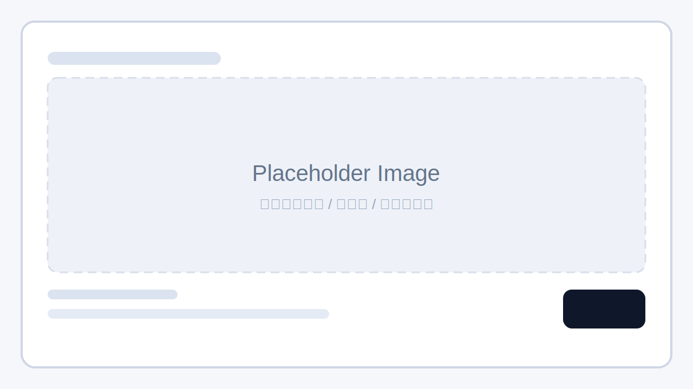

<div align="center">
  
  <h1>CollabVibe</h1>
  <p>连接即时通讯平台与 AI Agent 后端的协作式编程编排引擎。</p>
  <p>
    <a href="./README.md"><strong>English</strong></a> |
    <a href="./README.zh-CN.md"><strong>中文</strong></a>
  </p>
</div>

## 为什么是 CollabVibe

- 协作是第一生产力，而聊天协作平台本来就是团队推进真实工作的主界面。
- Human-in-the-loop 能把 Agent 从高风险自动化工具，变成持续放大产能的协作系统，做到 `1 + 1` 大于 `10`。
- 它直接复用企业已经具备的权限体系、通知链路、组织触达能力和协作习惯。
- 它把不同模型整合到一个统一操作面上，帮助团队更充分地利用已有账号、供应商与预算资源。
- 它让 Agent 指挥不再绑定电脑端，离开工位也能持续高效推进任务。

## 已支持 Backend

| Backend | Transport | 接入方式 | 状态 | 说明 |
| --- | --- | --- | --- | --- |
| `codex` | `codex` | API | 已支持 | 通过 Codex protocol / stdio 接入 |
| `opencode` | `acp` | API | 已支持 | 通过 ACP 接入 |
| `claude-code` | `acp` | API | 已支持 | 通过 ACP 接入 |
| `codex` | TBD | RefreshToken | 规划中 | 基于平台 RefreshToken 的接入方式在路线图中 |
| `claude-code` | TBD | RefreshToken | 规划中 | 基于平台 RefreshToken 的接入方式在路线图中 |
| `github-copilot` | TBD | RefreshToken | 规划中 | 当前代码未接入 |
| `gemini-cli` | TBD | RefreshToken | 规划中 | 当前代码未接入 |
| `trae-cli` | TBD | RefreshToken | 规划中 | 当前代码未接入 |

## 已支持 IM 平台

| 平台 | 状态 | 当前能力 | 说明 |
| --- | --- | --- | --- |
| Feishu / Lark | 已支持 | 消息事件、卡片、Bot 菜单、流式输出 | 当前主平台 |
| Slack | 进行中 | 已有输出适配与 socket 基础能力 | 应用层主链路尚未接完 |
| MS Teams | 规划中 | 未接入 | 预留扩展方向 |

## 快速开始

### 1. 安装依赖

```bash
npm install
```

### 2. 配置环境变量

```bash
cp .env.example .env
```

推荐先使用下面这份 `.env` 基线配置：

```dotenv
FEISHU_APP_ID=cli_xxxxxxxxxx
FEISHU_APP_SECRET=xxxxxxxxxxxxxxxx

CODEX_APP_SERVER_CMD=codex app-server
CODEX_WORKSPACE_CWD=/path/to/workspace
SYS_ADMIN_USER_IDS=ou_xxxxxxxxxx

# 项目级 i18n 语言
# 支持：zh-CN | en-US
APP_LOCALE=zh-CN
```

常见最小配置：

- `FEISHU_APP_ID`
- `FEISHU_APP_SECRET`
- `CODEX_APP_SERVER_CMD`
- `CODEX_WORKSPACE_CWD`
- `SYS_ADMIN_USER_IDS`
- `APP_LOCALE`（可选：`zh-CN` 或 `en-US`，默认 `zh-CN`）

### 3. 启动服务

```bash
npm run start:dev
```


Placeholder：这里替换为 Quickstart 录屏封面，建议展示本地启动、飞书触发与流式输出。

## 说明

- 运行日志与本地数据目录默认不纳入 Git。
- 如果你要修改跨层数据流，请先阅读 `AGENTS.md`。
- 完整的产品、架构与运维文档位于 `docs/`。
