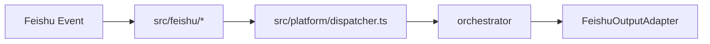
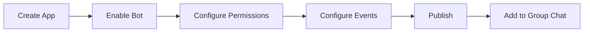

# Feishu Integration

Feishu / Lark is currently the primary platform for the system, and it is integrated via WebSocket Stream mode.

## Understand the integration first

| Item | Current implementation |
| --- | --- |
| Event intake | WebSocket Stream |
| Main entry point | `src/feishu/feishu-ws-app.ts` |
| Bot interactions | messages, cards, bot menu |
| Platform output | `src/feishu/channel/*` |




> Placeholder: add a screenshot of the Feishu Open Platform app home page and mark App ID, permission settings, and event subscription entry points.

## Create the app

Recommended sequence:

| Step | Action |
| --- | --- |
| 1 | Create an internal enterprise app in the Feishu Open Platform |
| 2 | Enable bot capability |
| 3 | Get the `App ID` and `App Secret` |
| 4 | Grant the required permissions |
| 5 | Configure event subscriptions |
| 6 | Configure app visibility and publish |
| 7 | Add the app to a group chat or enable 1:1 chat usage |


> Placeholder: add a step-by-step screenshot flow for “Create enterprise internal app” and mark the relevant buttons.



## Environment variables

| Variable | Description |
| --- | --- |
| `FEISHU_APP_ID` | App ID |
| `FEISHU_APP_SECRET` | App secret |
| `FEISHU_SIGNING_SECRET` | Event signing secret; usually optional in Stream mode |
| `FEISHU_ENCRYPT_KEY` | Encryption support for encrypted events |
| `FEISHU_API_BASE_URL` | Defaults to `https://open.feishu.cn/open-apis` |

```dotenv
FEISHU_APP_ID=cli_xxx
FEISHU_APP_SECRET=xxx
FEISHU_SIGNING_SECRET=
FEISHU_ENCRYPT_KEY=
FEISHU_API_BASE_URL=https://open.feishu.cn/open-apis
```

## Permissions

The following permissions come from `scripts/export-feishu-scopes.ts` and the current code paths.

| Permission | Purpose |
| --- | --- |
| `im:message` | Read and send direct and group messages |
| `im:message:send_as_bot` | Send messages as the app/bot |
| `im:message:patch` | Update messages / interactive cards |
| `cardkit:card:read` | Read card data |
| `cardkit:card:write` | Create and update cards |
| `im:message:pin` | Pin messages |
| `contact:user.base:readonly` | Read basic user info |
| `im:chat.members:read` | Read group member lists |


> Placeholder: add a screenshot of the permissions page and highlight the minimum required scopes.

## Event subscriptions

The current code registers the following events:

| Event | Purpose |
| --- | --- |
| `im.message.receive_v1` | Receive user messages |
| `card.action.trigger` | Receive card callbacks |
| `im.chat.member.bot.added_v1` | Bot added to group chat |
| `im.chat.member.bot.deleted_v1` | Bot removed from group chat |
| `im.chat.member.user.added_v1` | New member joined the group chat |
| `application.bot.menu_v6` | Bot menu event |


> Placeholder: add a screenshot of the event subscription page showing the event list and callback mode selection.

## Visibility and release

| Setting | Recommendation |
| --- | --- |
| App visibility | Include the users and groups that need the bot |
| Version publishing | Publish the app version after permissions and events are ready |
| Group capability | Add the bot to the target group chats |
| Direct-message capability | Confirm the app allows 1:1 chat with the bot |


> Placeholder: add screenshots of the app release page and visibility settings page.

## Minimal validation checklist

| Check | Expected result |
| --- | --- |
| Bot can join a group chat | The bot is visible in the group |
| User messages trigger events | `im.message.receive_v1` works |
| Card buttons call back successfully | `card.action.trigger` works |
| Bot menu triggers work | `application.bot.menu_v6` works |
| Bot can send messages / update cards | Output path is functioning |

```bash
npm run start:dev
tail -f data/logs/app.log
```


> Placeholder: add a complete Feishu validation recording, ideally covering “join group -> send message -> click card button”.
