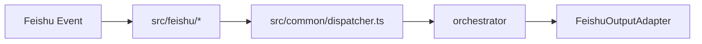
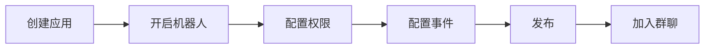

# Feishu 平台接入

当前系统的主平台是 Feishu / Lark，接入方式为 WebSocket Stream 模式。

## 接入前先理解

| 项目 | 当前实现 |
| --- | --- |
| 事件接收 | WebSocket Stream |
| 主要入口 | `src/feishu/feishu-ws-app.ts` |
| Bot 交互 | 消息、卡片、Bot 菜单 |
| 平台输出 | `src/feishu/channel/*` |



Feishu 开放平台入口：

- https://open.feishu.cn/app

## 创建应用

推荐步骤：

| 步骤 | 操作 |
| --- | --- |
| 1 | 在 Feishu 开放平台创建企业自建应用 |
| 2 | 启用机器人能力 |
| 3 | 获取 `App ID` 与 `App Secret` |
| 4 | 开通所需权限 |
| 5 | 配置事件订阅 |
| 6 | 配置应用可见范围并发布 |
| 7 | 将应用加入群聊或开放单聊使用 |



## 环境变量

| 变量 | 说明 |
| --- | --- |
| `FEISHU_APP_ID` | 应用 ID |
| `FEISHU_APP_SECRET` | 应用密钥 |
| `FEISHU_SIGNING_SECRET` | 事件签名密钥；Stream 模式通常可不填 |
| `FEISHU_ENCRYPT_KEY` | 加密事件支持 |
| `FEISHU_API_BASE_URL` | 默认 `https://open.feishu.cn/open-apis` |

```dotenv
FEISHU_APP_ID=cli_xxx
FEISHU_APP_SECRET=xxx
FEISHU_SIGNING_SECRET=
FEISHU_ENCRYPT_KEY=
FEISHU_API_BASE_URL=https://open.feishu.cn/open-apis
```

## 权限

以下权限使用你提供的当前权限列表整理，按租户权限维度列出：

| 权限 | 用途 |
| --- | --- |
| `cardkit:card:write` | 创建与更新卡片 |
| `contact:contact.base:readonly` | 读取通讯录基础信息 |
| `im:message:send_as_bot` | 以应用身份发送消息 |
| `contact:user.base:readonly` | 读取用户基础信息 |
| `im:chat` | 访问群组相关能力 |
| `contact:user.base:readonly` | 读取用户基础信息 |
| `im:chat.members:read` | 读取群成员列表 |
| `im:chat.menu_tree:read` | 读取群菜单 |
| `im:chat.menu_tree:write_only` | 写入群菜单 |
| `im:chat.top_notice:write_only` | 写入群置顶公告 |
| `im:chat.widgets:read` | 读取群组件 |
| `im:chat.widgets:write_only` | 写入群组件 |
| `im:chat:readonly` | 读取群信息 |
| `im:message` | 获取与发送消息 |
| `im:message.group_at_msg:readonly` | 读取群内 @ 机器人消息 |
| `im:message.group_msg` | 处理群消息 |
| `im:message.p2p_msg:readonly` | 读取单聊消息 |

如果你要去平台侧配置，直接从这里进入：

- https://open.feishu.cn/app

## 事件订阅

根据你提供的事件配置截图，当前应订阅以下事件：

| 事件 | 用途 |
| --- | --- |
| `im.message.receive_v1` | 接收用户消息 |
| `card.action.trigger` | 接收卡片回调 |
| `im.chat.member.bot.added_v1` | Bot 被加入群聊 |
| `im.chat.member.bot.deleted_v1` | Bot 被移出群聊 |
| `im.chat.member.user.added_v1` | 新成员加入群聊 |
| `application.bot.menu_v6` | Bot 菜单事件 |

回调方面，当前需要保留：

| 回调 | 用途 |
| --- | --- |
| `card.action.trigger` | 接收卡片交互回调 |

你给的回调截图里还能看到 `url.preview.get` 和 `profile.view.get`，但它们不属于当前主链路必需项。

## 可见性与发布

| 配置项 | 建议 |
| --- | --- |
| 应用可见范围 | 覆盖需要使用机器人的用户与群 |
| 版本发布 | 权限与事件配置完成后发布应用版本 |
| 群聊能力 | 将 Bot 添加到目标群聊 |
| 单聊能力 | 确认应用允许用户单聊机器人 |

## 最小验证清单

| 检查项 | 预期 |
| --- | --- |
| Bot 可加入群聊 | 群中能看到 Bot |
| 用户发消息可触发事件 | `im.message.receive_v1` 生效 |
| 卡片按钮可回调 | `card.action.trigger` 生效 |
| Bot 菜单可触发 | `application.bot.menu_v6` 生效 |
| 机器人能发消息/更新卡片 | 输出链路正常 |

```bash
npm run start:dev
tail -f data/logs/app.log
```
