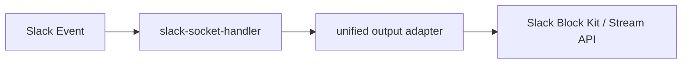
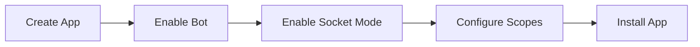

# Slack 平台接入

Slack 相关代码已具备基础输出与 Socket Mode 处理能力，但应用层尚未像 Feishu 一样完成完整接线。

## 当前代码能力

| 模块 | 作用 |
| --- | --- |
| `src/slack/slack-socket-mode-app.ts` | 处理 Socket Mode 启动与接线 |
| `src/slack/slack-message-handler.ts` | 解析 Slack 消息并路由命令 |
| `src/slack/channel/*` | 将统一输出渲染为 Slack 消息与更新 |




## 目标接入方式

| 项目 | 方案 |
| --- | --- |
| 事件接收 | Socket Mode |
| 消息类型 | `message` / `app_mention` |
| 交互类型 | `block_actions` |
| 输出方式 | `chat.postMessage` / `chat.update` / `reactions.*` / Stream API |

## 飞书 Card 到 Slack Block Kit 的映射

Slack 没有“@ bot 后直接弹出平台内建帮助卡片”的机制，因此帮助面板必须作为应用自己发送的一条 Block Kit 消息来承载，再通过 `block_actions` 原地更新。

| Feishu 能力 | Slack 落地 |
| --- | --- |
| `@bot` 空消息直接回帮助卡 | `app_mention` / `message` 命中空文本后，由 `slack-message-handler` 主动发送帮助面板消息 |
| 卡片内面板切换 | 同一条消息通过 `chat.update` 原地切换 Block Kit blocks |
| `card.action.trigger` | `block_actions` |
| 主帮助卡首页 | Block Kit `header + section + actions` |
| 子面板（线程/历史/技能/后端/turn） | 同一消息的不同 blocks 视图 |
| 卡片表单 | 优先改为命令驱动或 modal；当前线程创建先用帮助面板按钮 + 独立表单消息 |
| 卡片内审批按钮 | 继续沿用现有 Block Kit button action |

约束：

- 仍然遵守路径 A：Slack 平台入口接收事件，平台层解析后调用共享命令或 orchestrator，再由 Slack 输出层渲染。
- 不引入 Slack 专属后端身份或线程状态持久化字段。
- 帮助面板只做 UI 导航，不改变 `projectId -> threadRecord -> backendIdentity` 的主数据流。

## 创建 Slack App

| 步骤 | 操作 |
| --- | --- |
| 1 | 在 Slack 开发者后台创建 App |
| 2 | 启用 Bot User |
| 3 | 启用 Socket Mode |
| 4 | 创建 App-level Token |
| 5 | 配置 Bot Token Scopes |
| 6 | 配置 Event Subscriptions 与 Interactivity |
| 7 | 将应用安装到目标 Workspace |




## 需要的 Token

| Token | 用途 |
| --- | --- |
| Bot User OAuth Token (`xoxb-`) | 调用 `chat.postMessage`、`chat.update`、`reactions.*` 等 Web API |
| App-level Token (`xapp-`) | Socket Mode 建立 WebSocket 连接 |

```dotenv
SLACK_BOT_TOKEN=xoxb-xxx
SLACK_APP_TOKEN=xapp-xxx
```

## 建议权限范围

| Scope | 用途 |
| --- | --- |
| `app_mentions:read` | 接收 `app_mention` 事件 |
| `chat:write` | 发送与更新消息 |
| `reactions:write` | 添加/移除 emoji reaction |
| `channels:history` | 读取公有频道消息事件 |
| `groups:history` | 读取私有频道消息事件 |
| `im:history` | 读取 DM 消息事件 |
| `mpim:history` | 读取多人私信消息事件 |
| `connections:write` | Socket Mode 建立连接（App-level Token） |

> 如果只计划通过 `app_mention` 驱动命令，可先最小化配置 `app_mentions:read` + `chat:write`，再根据接入范围补 `*:history`。


## 事件与交互

| 配置项 | 值 |
| --- | --- |
| Bot Event | `app_mention` |
| Bot Event | `message.channels` |
| Bot Event | `message.groups` |
| Bot Event | `message.im` |
| Bot Event | `message.mpim` |
| Interactivity | 启用 Block Actions |
| Socket Mode | 启用 |


## 与当前代码的对应关系

| Slack 能力 | 代码位置 |
| --- | --- |
| 接收 `events_api` / `interactive` | `slack-socket-handler.ts` |
| 处理 `message` / `app_mention` | `slack-socket-handler.ts` |
| 处理 `block_actions` | `slack-socket-handler.ts` |
| 发消息 | `chat.postMessage` |
| 更新消息 | `chat.update` |
| 流式消息 | `chat.startStream` / `chat.appendStream` / `chat.stopStream` |
| reaction | `reactions.add` / `reactions.remove` |

## 当前状态说明

| 项目 | 状态 |
| --- | --- |
| 底层包 | 已存在 |
| 应用层 handler | 未完成 |
| `src/server.ts` 装配 | 未完成 |
| 生产可用性 | 需补完整接线与实测 |

```bash
rg -n "slack" packages/channel-slack src
```


