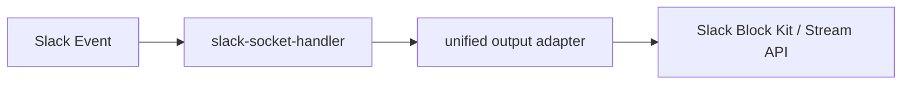
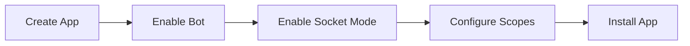

# Slack 平台接入

Slack 相关代码已具备基础输出与 Socket Mode 处理能力，但应用层尚未像 Feishu 一样完成完整接线。

## 当前代码能力

| 模块 | 作用 |
| --- | --- |
| `packages/channel-slack/src/slack-socket-handler.ts` | 处理 Socket Mode 事件 |
| `packages/channel-slack/src/slack-message-client.ts` | 调用 Slack Web API |
| `packages/channel-slack/src/slack-output-adapter.ts` | 将统一输出渲染为 Slack Block Kit / Stream API |




> Placeholder：在这里插入 Slack App 配置总览截图，标出 Socket Mode、OAuth、Event Subscriptions 入口。

## 目标接入方式

| 项目 | 方案 |
| --- | --- |
| 事件接收 | Socket Mode |
| 消息类型 | `message` / `app_mention` |
| 交互类型 | `block_actions` |
| 输出方式 | `chat.postMessage` / `chat.update` / `reactions.*` / Stream API |

## 创建 Slack App

| 步骤 | 操作 |
| --- | --- |
| 1 | 在 Slack 开发者后台创建 App |
| 2 | 启用 Bot User |
| 3 | 启用 Socket Mode |
| 4 | 创建 App-level Token |
| 5 | 配置 Bot Token Scopes |
| 6 | 配置 Event Subscriptions 与 Interactivity |
| 7 | 将应用安装到目标 Workspace |


> Placeholder：在这里插入 Slack App 创建流程截图，建议展示 Socket Mode 与 OAuth 页面。



## 需要的 Token

| Token | 用途 |
| --- | --- |
| Bot User OAuth Token (`xoxb-`) | 调用 `chat.postMessage`、`chat.update`、`reactions.*` 等 Web API |
| App-level Token (`xapp-`) | Socket Mode 建立 WebSocket 连接 |

```dotenv
SLACK_BOT_TOKEN=xoxb-xxx
SLACK_APP_TOKEN=xapp-xxx
```

## 建议权限范围

| Scope | 用途 |
| --- | --- |
| `app_mentions:read` | 接收 `app_mention` 事件 |
| `chat:write` | 发送与更新消息 |
| `reactions:write` | 添加/移除 emoji reaction |
| `channels:history` | 读取公有频道消息事件 |
| `groups:history` | 读取私有频道消息事件 |
| `im:history` | 读取 DM 消息事件 |
| `mpim:history` | 读取多人私信消息事件 |
| `connections:write` | Socket Mode 建立连接（App-level Token） |

> 如果只计划通过 `app_mention` 驱动命令，可先最小化配置 `app_mentions:read` + `chat:write`，再根据接入范围补 `*:history`。


> Placeholder：在这里插入 OAuth Scope 页面截图，建议圈出最小权限集合。

## 事件与交互

| 配置项 | 值 |
| --- | --- |
| Bot Event | `app_mention` |
| Bot Event | `message.channels` |
| Bot Event | `message.groups` |
| Bot Event | `message.im` |
| Bot Event | `message.mpim` |
| Interactivity | 启用 Block Actions |
| Socket Mode | 启用 |


> Placeholder：在这里插入 Event Subscriptions 与 Interactivity 配置截图。

## 与当前代码的对应关系

| Slack 能力 | 代码位置 |
| --- | --- |
| 接收 `events_api` / `interactive` | `slack-socket-handler.ts` |
| 处理 `message` / `app_mention` | `slack-socket-handler.ts` |
| 处理 `block_actions` | `slack-socket-handler.ts` |
| 发消息 | `chat.postMessage` |
| 更新消息 | `chat.update` |
| 流式消息 | `chat.startStream` / `chat.appendStream` / `chat.stopStream` |
| reaction | `reactions.add` / `reactions.remove` |

## 当前状态说明

| 项目 | 状态 |
| --- | --- |
| 底层包 | 已存在 |
| 应用层 handler | 未完成 |
| `src/server.ts` 装配 | 未完成 |
| 生产可用性 | 需补完整接线与实测 |

```bash
rg -n "slack" packages/channel-slack src
```


> Placeholder：在这里插入 Slack 接入验证录屏；如果尚未完成，可替换为“待补录”说明视频封面。
