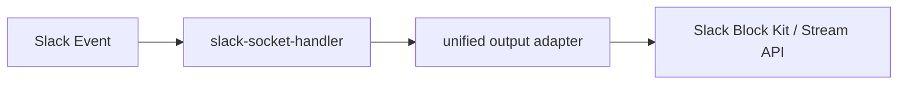
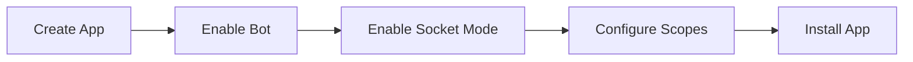

# Slack Integration

The Slack-related code already has foundational output and Socket Mode handling, but the application layer is not yet wired end-to-end the way Feishu is.

## Current code capabilities

| Module | Responsibility |
| --- | --- |
| `src/slack/slack-socket-mode-app.ts` | Handles Socket Mode bootstrap |
| `src/slack/slack-message-handler.ts` | Parses Slack messages and routes commands |
| `src/slack/channel/*` | Renders unified output into Slack messages / updates |




## Target integration shape

| Item | Approach |
| --- | --- |
| Event intake | Socket Mode |
| Message types | `message` / `app_mention` |
| Interaction type | `block_actions` |
| Output methods | `chat.postMessage` / `chat.update` / `reactions.*` / Stream API |

## Mapping Feishu cards to Slack Block Kit

Slack does not have a built-in “mention the bot and show a native help card” mechanism. The help panel therefore has to be sent as an app-owned Block Kit message and updated in place through `block_actions`.

| Feishu capability | Slack implementation |
| --- | --- |
| Empty `@bot` mention returns a help card | When `app_mention` / `message` matches empty text, `slack-message-handler` proactively sends the help panel message |
| Switching panels inside a card | Update the same message in place via `chat.update` |
| `card.action.trigger` | `block_actions` |
| Main help card home | Block Kit `header + section + actions` |
| Sub-panels (thread/history/skill/backend/turn) | Different block views in the same message |
| Card forms | Prefer command-driven flows or modals; current thread creation uses a help-panel button plus a separate form message |
| Approval buttons inside cards | Continue to use existing Block Kit button actions |

Constraints:

- Path A still applies: the Slack platform entry receives the event, the Platform layer parses it, shared commands or the orchestrator are invoked, and the Slack output layer renders the result.
- Do not introduce Slack-specific backend identity or thread-state persistence fields.
- The help panel is only UI navigation; it must not change the main data flow of `projectId -> threadRecord -> backendIdentity`.

## Create the Slack App

| Step | Action |
| --- | --- |
| 1 | Create an app in the Slack developer console |
| 2 | Enable Bot User |
| 3 | Enable Socket Mode |
| 4 | Create an App-level Token |
| 5 | Configure Bot Token Scopes |
| 6 | Configure Event Subscriptions and Interactivity |
| 7 | Install the app to the target workspace |




## Required tokens

| Token | Purpose |
| --- | --- |
| Bot User OAuth Token (`xoxb-`) | Calls Web APIs such as `chat.postMessage`, `chat.update`, and `reactions.*` |
| App-level Token (`xapp-`) | Establishes the WebSocket connection for Socket Mode |

```dotenv
SLACK_BOT_TOKEN=xoxb-xxx
SLACK_APP_TOKEN=xapp-xxx
```

## Recommended scopes

| Scope | Purpose |
| --- | --- |
| `app_mentions:read` | Receive `app_mention` events |
| `chat:write` | Send and update messages |
| `reactions:write` | Add / remove emoji reactions |
| `channels:history` | Read public-channel message events |
| `groups:history` | Read private-channel message events |
| `im:history` | Read DM message events |
| `mpim:history` | Read multi-party DM message events |
| `connections:write` | Establish Socket Mode connections (App-level Token) |

> If you only plan to drive commands through `app_mention`, you can start with the minimum set: `app_mentions:read` + `chat:write`, then add the `*:history` scopes based on the target coverage.


## Events and interactions

| Setting | Value |
| --- | --- |
| Bot Event | `app_mention` |
| Bot Event | `message.channels` |
| Bot Event | `message.groups` |
| Bot Event | `message.im` |
| Bot Event | `message.mpim` |
| Interactivity | Enable Block Actions |
| Socket Mode | Enabled |


## How the current code maps to Slack capabilities

| Slack capability | Code location |
| --- | --- |
| Receive `events_api` / `interactive` | `slack-socket-handler.ts` |
| Handle `message` / `app_mention` | `slack-socket-handler.ts` |
| Handle `block_actions` | `slack-socket-handler.ts` |
| Send messages | `chat.postMessage` |
| Update messages | `chat.update` |
| Stream messages | `chat.startStream` / `chat.appendStream` / `chat.stopStream` |
| Reactions | `reactions.add` / `reactions.remove` |

## Current status

| Item | Status |
| --- | --- |
| Low-level package | Present |
| Application-layer handler | Not finished |
| `src/server.ts` wiring | Not finished |
| Production readiness | Needs full wiring and real validation |

```bash
rg -n "slack" packages/channel-slack src
```


