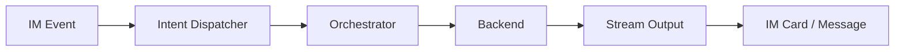

# Project Introduction

`CollabVibe` is a collaborative programming orchestration engine that connects IM platforms with AI agent backends. Its core capabilities include:

- IM message and interactive-card integration
- Multi-backend agent execution
- approval-driven human-in-the-loop workflows
- local persistence for threads, snapshots, audit data, and state


> Placeholder: add an overview image showing the main UI, card flow, or agent collaboration flow. Recommended size: 1280x720.

## Design goals

| Theme | Description |
| --- | --- |
| Human-in-the-Loop | High-risk actions enter an approval flow and continue only after a user decision |
| Collaborative development | Continuous execution, review, merge, and snapshotting around a thread |
| Local data retention | SQLite, logs, configuration, and workspace state are stored locally |



## Platform support

| Platform | Status | Current capability | Code location |
| --- | --- | --- | --- |
| Feishu / Lark | Supported | WebSocket events, messages, cards, bot menu, group and DM entry points | `src/feishu/*`, `packages/channel-feishu/*` |
| Slack | TODO | Output adapter and socket handler exist, but the application-layer main path is not fully wired | `packages/channel-slack/*` |
| MS Teams | TODO | Reserved as an extension direction; not integrated in the current repository | — |


> Placeholder: add a platform capability matrix screenshot and highlight that Feishu is integrated while Slack is currently “output layer ready / application layer pending”.

## Backend support

| Backend | Transport | Access method | Status | Notes |
| --- | --- | --- | --- | --- |
| `codex` | `codex` | API | Supported | Connected through the Codex protocol / stdio |
| `opencode` | `acp` | API | Supported | Connected through ACP |
| `claude-code` | `acp` | API | Supported | Connected through ACP |
| `codex` | TBD | RefreshToken | Planned | Platform RefreshToken-based access is on the roadmap |
| `claude-code` | TBD | RefreshToken | Planned | Platform RefreshToken-based access is on the roadmap |
| `github-copilot` | TBD | RefreshToken | Planned | Not integrated in the current code |
| `gemini-cli` | TBD | RefreshToken | Planned | Not integrated in the current code |
| `trae-cli` | TBD | RefreshToken | Planned | Not integrated in the current code |

```bash
# Preview the documentation locally
npm run docs:dev
```

## Authentication and authorization

### Platform integration credentials

| Item | Description |
| --- | --- |
| `FEISHU_APP_ID` | Feishu app ID |
| `FEISHU_APP_SECRET` | Feishu app secret |
| `FEISHU_SIGNING_SECRET` | Feishu event-signature secret |
| `FEISHU_ENCRYPT_KEY` | Feishu encrypted-event configuration |

### In-system access control

| Component | Purpose |
| --- | --- |
| `SYS_ADMIN_USER_IDS` | Initial import of system administrators |
| `users` table | Persistent source of system-level roles |
| `RoleResolver` | Resolves roles |
| `authorize` / `command-guard` | Command-level authorization checks |


> Placeholder: add a layered diagram showing “platform integration credentials + in-system role control”.

## How it is used

| Step | Description |
| --- | --- |
| 1 | A user sends a message in IM or clicks a card |
| 2 | The Platform layer parses the event and forwards it into unified intent dispatch |
| 3 | The shared layer decides whether the request takes the platform-command or agent-command path |
| 4 | The orchestrator resolves the thread, backend, and runtime config |
| 5 | The backend executes and pushes intermediate state back through streaming events |
| 6 | High-risk actions enter an approval flow |
| 7 | Results, thread state, and audit data are written to local storage |


> Placeholder: add a flow chart of “user sends message -> agent executes -> approval -> result written back”.


> Placeholder: add a 1–3 minute product demo covering “start a task, watch streaming output, handle an approval”.

## Quick entry points

If this is your first time reading the project, start with the platform integrations and then move into the architecture section:

- [Feishu Integration](/00-overview/platform-feishu)
- [Slack Integration](/00-overview/platform-slack)
- [System Overview](/00-overview/system-overview)

## Data retained locally

| Category | Default location |
| --- | --- |
| Main SQLite database | `data/codex-im.db` |
| Backend configuration | `data/config` |
| Logs | `data/logs` |
| Workspace / worktree / snapshots | local code directory and derived worktrees |

```bash
ls -lah data
ls -lah data/logs
```

## Related documents

- [System Overview](/00-overview/system-overview)
- [Feishu Integration](/00-overview/platform-feishu)
- [Slack Integration](/00-overview/platform-slack)
- [Execution Paths and Data Flow](/01-architecture/data-paths)
- [Core Entities: Project / Thread / Turn](/01-architecture/core-entities)
- [Layering and Module Contracts](/01-architecture/invariants)
