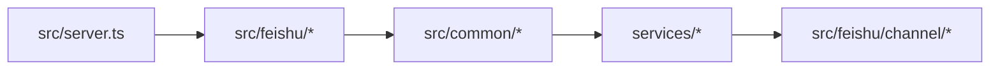

# System Overview

The system is composed of four kinds of capabilities: platform integration, shared orchestration, foundational packages, and local state.

## System structure

| Layer | Purpose | Typical directories |
| --- | --- | --- |
| Platform | Receives platform events and handles platform-specific interactions | `src/feishu/*`, `src/slack/*` |
| Shared L1 + Services | Intent dispatch, thread management, backend scheduling, approvals, authorization, persistence | `src/common/*`, `services/*` |
| Packages | Protocol clients, git operations, logging, fundamental types | `packages/*` |
| Local State | Database storage, logs, config, workspace state | `data/*`, local workspace |

## Key system objects

| Object | Purpose |
| --- | --- |
| Platform Event | IM platform input such as messages, cards, and menu events |
| Thread | The main axis of collaboration; binds backend and session |
| UnifiedAgentEvent | Unified streaming event that hides backend transport differences |
| Local State | Thread registry, user repository, approval records, audit data, snapshots |

## External-facing capabilities

| Audience | Capability |
| --- | --- |
| Users | Trigger commands in IM, view streaming results, approve actions |
| Administrators | Manage backends, projects, members, and system configuration |
| Developers | Extend platforms, backends, and shared capabilities through the unified paths |

