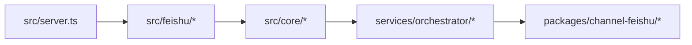

# 系统总览

系统由四类能力组成：平台接入、共享协调、基础包、本地状态。

> Placeholder：在这里插入最新版系统架构总图，建议用四层结构表示 `src / services / packages / local state`。

## 系统结构

| 层级 | 作用 | 典型目录 |
| --- | --- | --- |
| Platform | 接收平台事件，处理平台特有交互 | `src/feishu/*` |
| Core / Services | intent 分发、线程管理、backend 调度、审批、权限、持久化 | `src/core/*`, `services/*` |
| Packages | 通道抽象、协议客户端、输出适配、基础类型 | `packages/*` |
| Local State | 数据库存储、日志、配置、工作区状态 | `data/*`, 本地 workspace |

## 系统关键对象

| 对象 | 作用 |
| --- | --- |
| Platform Event | IM 平台输入，如消息、卡片、菜单事件 |
| Thread | 协作执行主轴，绑定 backend 与 session |
| UnifiedAgentEvent | 屏蔽 backend transport 差异后的统一流式事件 |
| Local State | thread registry、user repository、approval、audit、snapshot |

## 对外能力

| 面向对象 | 能力 |
| --- | --- |
| 用户 | 在 IM 中触发命令、查看流式结果、审批动作 |
| 管理员 | 管理 backend、项目、成员、系统配置 |
| 开发者 | 基于统一路径扩展平台、backend、共享能力 |

> Placeholder：在这里插入系统总览讲解视频封面或录屏。
