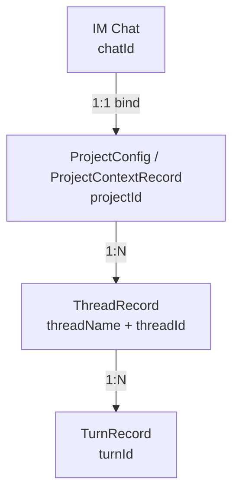
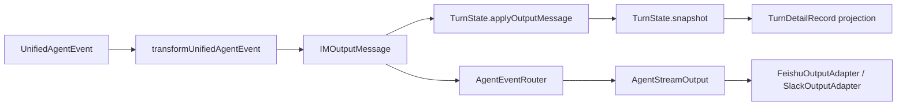

# Core Entities: Project / Thread / Turn

In the current codebase, the three most important objects are not split by platform. They are split by the main collaboration axis:

- `Project` owns the aggregate root and project-level configuration
- `Thread` owns an ongoing collaboration session
- `Turn` owns a single execution inside a thread

Together they form the smallest stable skeleton of the system.


> Placeholder: add a relationship diagram for `Project / Thread / Turn`, ideally also showing `UserThreadBinding` and `RuntimeConfig`.

## Relationship among the three



## 1. Project

`Project` appears in code mainly as two projections:

| Type | Location | Purpose |
| --- | --- | --- |
| `ProjectConfig` | `services/admin-api/src/admin-state.ts` | Persisted project configuration; the true project aggregate root |
| `ProjectContextRecord` | `services/orchestrator/src/project-resolver.ts` | The project-context projection from the orchestrator's point of view |

### Project responsibilities

| Responsibility | Description |
| --- | --- |
| Aggregate root | `thread / turn / snapshot / user-thread-binding` all ultimately belong to `projectId` |
| Platform binding | `chatId` is only the 1:1 platform binding of a Project |
| Runtime defaults | Stores project-level defaults such as `cwd`, `defaultBranch`, `sandbox`, and `approvalPolicy` |
| Routing starting point | Every IM entry first resolves `chatId -> projectId` |

### Key Project fields

| Field | Description |
| --- | --- |
| `id` | `projectId`, the internal system primary key |
| `chatId` | IM platform binding; not the real persistent primary key for threads/turns |
| `cwd` | Project working directory |
| `defaultBranch` | Default branch |
| `sandbox` | Sandbox policy |
| `approvalPolicy` | Approval policy |
| `status` | Project activation status |

### Project invariants

- Project is the aggregate root; `chatId` cannot directly replace `projectId`
- Thread history does not move with chat migration; rebinding a group chat only updates the Project-to-Chat binding
- Before entering domain logic, the orchestrator must resolve through `ProjectResolver.findProjectByChatId(chatId)`

## 2. Thread

`Thread` is represented by `ThreadRecord` in code and is defined in `services/orchestrator/src/thread-state/thread-registry.ts`.

### Thread responsibilities

| Responsibility | Description |
| --- | --- |
| Main collaboration axis | Represents a persistent branch/session/task line |
| Binds backend identity | Stores `BackendIdentity`, deciding which backend the thread uses |
| Binds the backend session handle | `threadId` is the opaque handle allocated by the backend |
| Carries the turn sequence | A thread continuously produces multiple turns |

### Key Thread fields

| Field | Description |
| --- | --- |
| `projectId` | Owning project |
| `threadName` | Logical thread name within the project |
| `threadId` | Backend thread ID / session ID |
| `backend` | The indivisible `BackendIdentity` |

### Thread invariants

- `ThreadRecord.backend` is the only true source of thread backend identity
- backend information must be passed atomically and must not be split into `model + transport + backendName`
- backend identity cannot be changed after the thread is created
- `UserThreadBinding` can only point to the thread; it must not duplicate backend metadata

## 3. Turn

`Turn` is no longer a single class. It is a three-model collaboration:

| Model | Location | Role |
| --- | --- | --- |
| `TurnState` | `packages/channel-core/src/turn-state.ts` | Runtime in-memory model; the only streaming aggregation source |
| `TurnRecord` | `services/orchestrator/src/turn-state/turn-record.ts` | Persistent index/state record |
| `TurnDetailRecord` | `services/orchestrator/src/turn-state/turn-detail-record.ts` | Persistent full-detail record; the canonical history payload |

### 3.1 TurnState

`TurnState` is the runtime model created by `EventPipeline` when a turn becomes active.

It is **not** a platform object and **not** a persistent entity. It exists to aggregate turn execution in memory and expose a unified interface to the rest of the orchestrator.

#### TurnState responsibilities

| Responsibility | Description |
| --- | --- |
| Runtime aggregation | Aggregates content, reasoning, plans, tool progress, tool output, token usage, and metadata |
| Unified write interface | Exposes a single API surface for incremental events and full updates |
| Runtime snapshot export | Produces a `snapshot()` used for persistence projection and UI summaries |
| Platform isolation | Ensures Feishu / Slack cannot become the source of truth for Turn content |

#### TurnState write interfaces

| Method | Purpose |
| --- | --- |
| `applyOutputMessage(message)` | Applies the normalized `IMOutputMessage` from Path B |
| `applyMetadata(metadata)` | Applies prompt/backend/model/turn-mode metadata through a single interface |
| `applyTurnSummary(summary)` | Applies final turn summary information |
| `snapshot()` | Exports the runtime projection |
| `toSummary()` | Exports a lightweight `IMTurnSummary` view |

#### TurnState contents

`TurnState` currently owns:

- metadata: `promptSummary / backendName / modelName / turnMode`
- content: final streamed message body
- reasoning
- plan draft + structured plan
- tool call progress
- tool outputs
- token usage
- runtime duration

> `lastAgentMessage` is **not** the canonical source inside `TurnState`. The canonical message source is `content`. If a compatibility field is needed outside, it is derived from `content`.

### 3.2 TurnRecord

`TurnRecord` is the lightweight persistent index record.

#### TurnRecord responsibilities

| Responsibility | Description |
| --- | --- |
| Lifecycle index | Tracks `running / awaiting_approval / completed / accepted / reverted / interrupted / failed` |
| Diff and approval index | Stores `filesChanged`, `diffSummary`, approval flags, snapshot references |
| Query anchor | Supports turn lookup, blocking-turn checks, and snapshot relations |

#### Key TurnRecord fields

| Field | Description |
| --- | --- |
| `projectId` | Owning project |
| `threadName` / `threadId` | Owning thread |
| `turnId` | Execution ID |
| `status` | Lifecycle state |
| `cwd` | Execution worktree |
| `snapshotSha` | Snapshot anchor |
| `approvalRequired` | Whether the turn entered approval flow |
| `filesChanged` / `diffSummary` / `stats` | Git diff summary |
| `tokenUsage` | Aggregated token usage |
| `createdAt` / `updatedAt` / `completedAt` | Lifecycle timestamps |

`TurnRecord` may still carry compatibility summary fields, but it is **not** the canonical full-message store.

### 3.3 TurnDetailRecord

`TurnDetailRecord` is the full persistent detail record and should be treated as the canonical history payload.

#### TurnDetailRecord responsibilities

| Responsibility | Description |
| --- | --- |
| Full history source | Supports “reopen full turn history at any time” |
| Runtime projection sink | Receives snapshots projected from `TurnState` |
| Detail rendering source | Backs historical cards / turn detail pages |

#### Key TurnDetailRecord fields

| Field | Description |
| --- | --- |
| `promptSummary` / `backendName` / `modelName` / `turnMode` | Turn metadata |
| `message` | Canonical final content body |
| `reasoning` | Stored reasoning body |
| `tools` | Tool-call progress timeline |
| `toolOutputs` | Tool outputs keyed by call |
| `planState` | Structured plan state |
| `agentNote` | Auxiliary runtime note |

### Turn invariants

- A Turn always hangs under a Thread, never directly under a Chat
- Turn persistence and lookup are always rooted in `projectId`
- `TurnState` is the only in-memory streaming aggregation source
- `TurnDetailRecord.message` is the canonical persisted message source
- Platform adapters must not become the write source of turn state

### Turn and AgentStreamOutput

`AgentStreamOutput` belongs to the output side of the system, not the Turn state side.

Relationship:



Meaning:

- `TurnState` aggregates the runtime truth
- `AgentStreamOutput` renders the already-normalized output to IM platforms
- Feishu / Slack consume output; they do not define Turn semantics

### Turn and user input commands

Turn creation starts from user input on Path A:

```text
User message
  -> IM handler
  -> orchestrator.handleIntent()
  -> recordTurnStart()
  -> create TurnRecord + TurnDetailRecord shell
  -> prepare/activate EventPipeline
  -> backend turn start
```

User input affects Turn in two distinct stages:

#### Stage A: before backend execution

Before the backend starts streaming, the orchestrator writes turn metadata through the **unified Turn interface**:

- `promptSummary`
- `backendName`
- `modelName`
- `turnMode`

This now flows through `TurnState.applyMetadata(...)` when runtime state exists, and only falls back to direct persistence when the runtime state has not yet been created.

#### Stage B: during backend execution

As the backend emits events:

- `EventPipeline` converts them into `IMOutputMessage`
- `TurnState.applyOutputMessage(...)` updates the runtime model
- the snapshot is projected into persistence
- the same normalized message is routed to `AgentStreamOutput`

### Turn completion

When the turn completes:

```text
turn_complete / turn_aborted
  -> EventPipeline
  -> finishTurn()
  -> TurnState.applyTurnSummary(...)
  -> TurnState.snapshot()
  -> finalizeTurnState(...)
  -> update TurnRecord + TurnDetailRecord
  -> AgentStreamOutput.completeTurn(...)
```

This guarantees:

- runtime truth is closed in the orchestrator
- persistence is updated from runtime state
- platform rendering happens after normalization

## Core data flow

```text
IM Event
  -> chatId
  -> ProjectResolver.findProjectByChatId(chatId)
  -> projectId
  -> ThreadRegistry.get(projectId, threadName)
  -> ThreadRecord.backend / ThreadRecord.threadId
  -> create or restore TurnRecord
  -> backend execution and event write-back
```

```ts
const project = projectResolver.findProjectByChatId(chatId);
const thread = threadRegistry.get(project.id, threadName);
```

## Why these three objects are the most important

| Object | What breaks without it |
| --- | --- |
| `Project` | The aggregate root becomes ambiguous and `chatId` pollutes persistence keys again |
| `Thread` | Backend identity and session recovery cannot be bound stably |
| `Turn` | A single execution, approval state, and historical audit cannot be represented |

## Relationship to other objects

| Object | Relationship to the three core entities |
| --- | --- |
| `BackendIdentity` | Immutable backend identity value object owned by Thread |
| `UserThreadBinding` | Thread pointer at the user dimension; not part of the core aggregate root |
| `RuntimeConfig` | Temporary assembly before each turn, sourced from Project + Thread |
| `UnifiedAgentEvent` | Unified event model propagated on Path B during turn execution |
