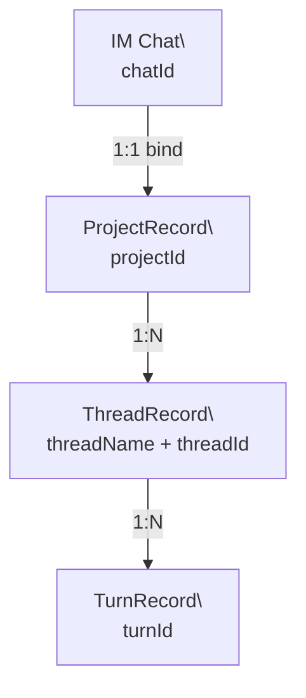

# 核心类：Project / Thread / Turn

当前代码里最稳定的三类核心对象仍然是：

- `Project`
- `Thread`
- `Turn`

只是它们的真实定义位置，已经不再是旧文档里写的那些文件。

## 三者关系

## 1. Project

当前定义：

- `services/project/project-types.ts`

核心语义：

- Project 是聚合根
- `chatId` 只是平台绑定
- `projectId` 是 thread / turn / snapshot / user-thread-binding 的持久归属

关键字段：

- `id`
- `name`
- `chatId`
- `cwd`
- `defaultBranch`
- `workBranch`
- `gitUrl`
- `sandbox`
- `approvalPolicy`
- `status`

## 2. Thread

当前定义：

- `services/thread/types.ts`

核心语义：

- Thread 是 project 下的持续协作线
- `threadId` 是 backend 分配的 opaque handle
- `backend` 是线程级 `BackendIdentity`
- `baseSha` / `hasDiverged` / `worktreePath` 是线程运行时状态的一部分

关键字段：

- `projectId`
- `threadName`
- `threadId`
- `backend`
- `baseSha`
- `hasDiverged`
- `worktreePath`

## 3. Turn

当前定义：

- `services/turn/types.ts`

核心语义：

- Turn 是 thread 下的一次执行
- 既保存生命周期状态，也保存 diff、token usage、最后消息等执行结果
- `TurnDetailRecord` 承载 reasoning、tool outputs、plan state 等细节

关键字段：

- `projectId`
- `threadName`
- `threadId`
- `turnId`
- `status`
- `cwd`
- `approvalRequired`
- `filesChanged`
- `diffSummary`
- `tokenUsage`
- `turnNumber`

## 相关对象

| 对象 | 作用 |
| --- | --- |
| `BackendIdentity` | Thread 的不可变后端身份 |
| `UserThreadBinding` | 用户维度的当前线程指针 |
| `RuntimeConfig` | turn 启动前临时组装的运行时配置 |
| `TurnDetailRecord` | turn 详情投影 |
| `TurnSnapshotRecord` | turn 对应的 snapshot 记录 |

## 当前文档修正点

旧版文档里引用了已经不存在或已经迁移的文件，例如：

- `services/project/admin-state.ts`
- `services/thread/thread-registry.ts`
- `services/turn/turn-record.ts`

当前应以 `project-types.ts`、`thread/types.ts`、`turn/types.ts` 为准。
