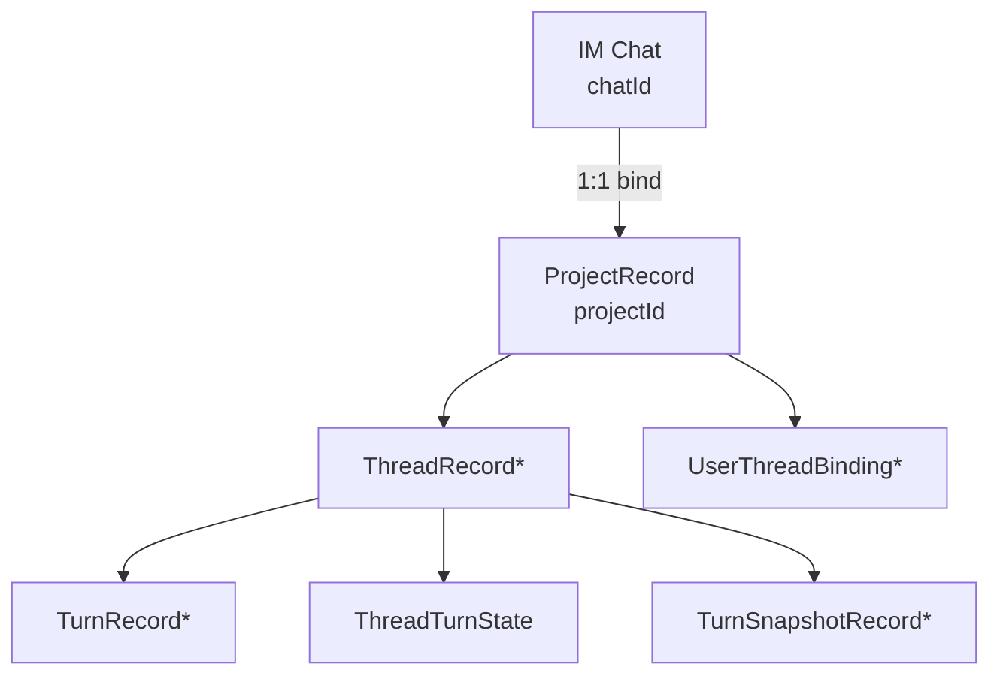
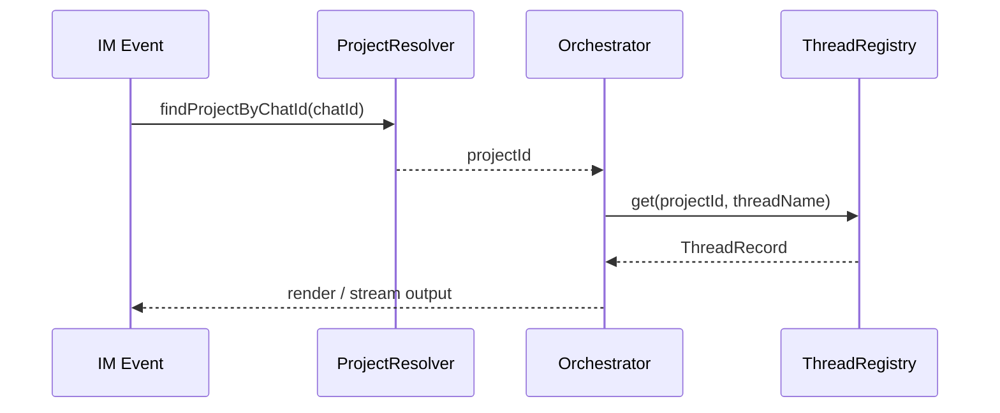

# Project Aggregate Architecture

## Core conclusions

- `Project` is the only aggregate root for business persistence
- `Project` and `Chat` keep a **1:1 binding**
- `Thread / Turn / Snapshot / ThreadTurnState / UserThreadBinding` all belong to `projectId`
- `chatId` only participates in IM routing and no longer serves as the primary key for thread history

## Aggregate relationship diagram

## Resolution path inside the main flow

## Persistent key principles

| Data | Primary ownership |
| --- | --- |
| Project configuration | `projectId` |
| ThreadRecord | `projectId + threadName` |
| TurnRecord | `projectId + turnId` |
| ThreadTurnState | `projectId + threadName` |
| TurnSnapshotRecord | `projectId + threadId + turnId` |
| UserThreadBinding | `projectId + userId` |

## Benefits

1. Rebinding a group chat no longer loses thread history
2. Chat lifecycle is decoupled from project history state
3. Domain ownership and persistence ownership are aligned
4. The boundary of `chatId -> projectId -> domain state` becomes clearer
