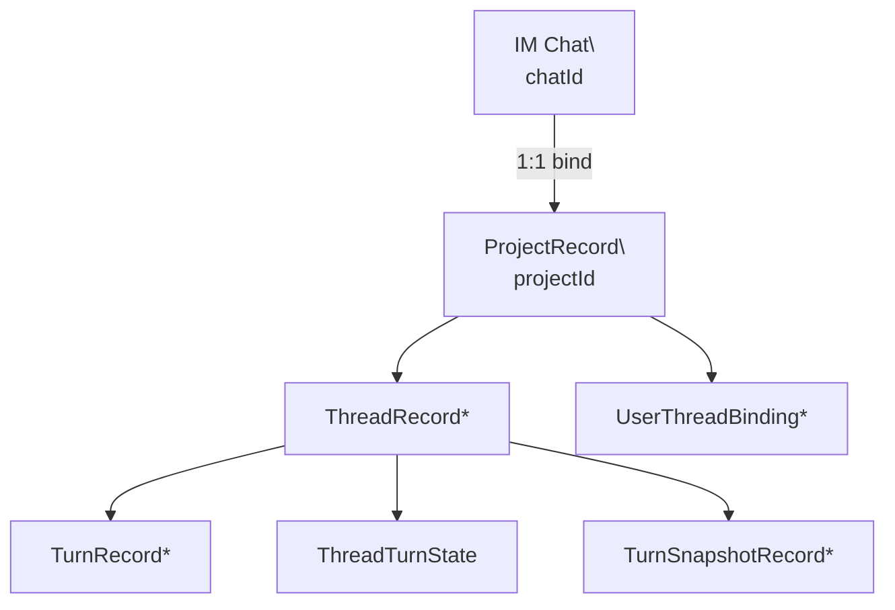
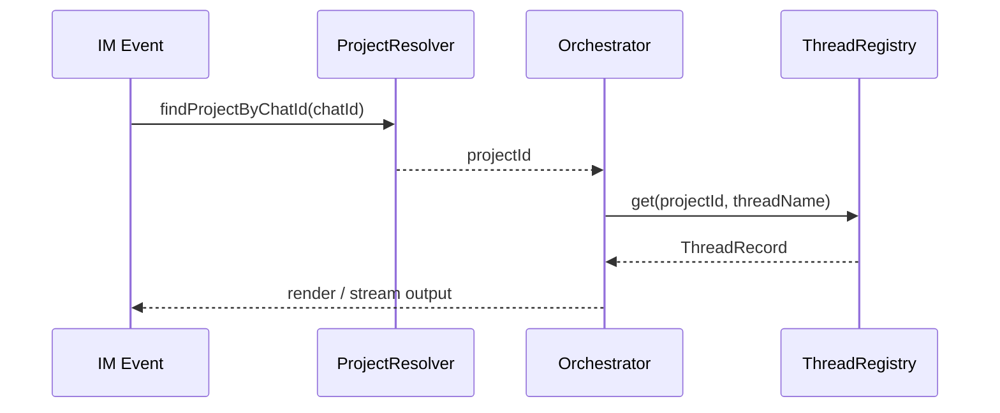

# Project 聚合架构

## 核心结论

- `Project` 是业务持久化的唯一聚合根
- `Project` 与 `Chat` 保持 **1:1 绑定**
- `Thread / Turn / Snapshot / ThreadTurnState / UserThreadBinding` 全部归属 `projectId`
- `chatId` 只负责 IM 路由，不再承担线程历史数据主键职责

## 聚合关系图

## 路径中的解析关系

## 持久化主键原则

| 数据 | 主归属 |
| --- | --- |
| Project 配置 | `projectId` |
| ThreadRecord | `projectId + threadName` |
| TurnRecord | `projectId + turnId` |
| ThreadTurnState | `projectId + threadName` |
| TurnSnapshotRecord | `projectId + threadId + turnId` |
| UserThreadBinding | `projectId + userId` |

## 收益

1. 群聊重绑不再丢失 thread 历史
2. chat 生命周期与 project 历史状态解耦
3. 领域归属与持久化归属一致
4. `chatId -> projectId -> domain state` 的边界更清晰
