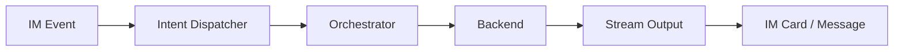

# 项目简介

`CollabVibe` 是连接即时通讯平台与 AI Agent 后端的协作式编程编排引擎，核心能力包括：

- IM 消息与交互卡片接入
- 多 backend Agent 执行
- 审批驱动的 Human-in-the-Loop 流程
- 线程、快照、审计、本地状态持久化


> Placeholder：在这里插入一张“系统主界面 / 卡片流 / Agent 协作过程”的总览图，建议尺寸 1280x720。

## 设计目标

| 主题 | 说明 |
| --- | --- |
| Human-in-the-Loop | 高风险动作进入审批流，由用户决定是否继续 |
| 协作开发 | 围绕 thread 持续执行、review、merge、snapshot |
| 数据本地留存 | SQLite、日志、配置、工作区状态保存在本地 |



## 平台支持

| 平台 | 状态 | 当前能力 | 代码位置 |
| --- | --- | --- | --- |
| Feishu / Lark | 已支持 | WS 事件、消息、卡片、Bot 菜单、群/单聊入口 | `src/feishu/*`, `packages/channel-feishu/*` |
| Slack | TODO | 已有输出适配与 socket handler，未完成应用层主链路接线 | `packages/channel-slack/*` |
| MS Teams | TODO | 预留平台扩展方向，当前仓库未接入 | — |


> Placeholder：在这里插入平台能力矩阵截图，建议标出 Feishu 已接入、Slack 当前处于“输出层就绪 / 应用层待接线”的状态。

## Backend 支持

| Backend | 传输 | 接入方式 | 状态 | 说明 |
| --- | --- | --- | --- | --- |
| `codex` | `codex` | API | 已支持 | 通过 Codex protocol / stdio 接入 |
| `opencode` | `acp` | API | 已支持 | 通过 ACP 接入 |
| `claude-code` | `acp` | API | 已支持 | 通过 ACP 接入 |
| `codex` | TBD | RefreshToken | 规划中 | 基于平台 RefreshToken 的接入方式在路线图中 |
| `claude-code` | TBD | RefreshToken | 规划中 | 基于平台 RefreshToken 的接入方式在路线图中 |
| `github-copilot` | TBD | RefreshToken | 规划中 | 当前代码未接入 |
| `gemini-cli` | TBD | RefreshToken | 规划中 | 当前代码未接入 |
| `trae-cli` | TBD | RefreshToken | 规划中 | 当前代码未接入 |

```bash
# 本地文档预览
npm run docs:dev
```

## 认证与鉴权

### 平台接入认证

| 项目 | 说明 |
| --- | --- |
| `FEISHU_APP_ID` | Feishu 应用 ID |
| `FEISHU_APP_SECRET` | Feishu 应用密钥 |
| `FEISHU_SIGNING_SECRET` | Feishu 事件签名校验密钥 |
| `FEISHU_ENCRYPT_KEY` | Feishu 加密事件配置 |

### 系统内权限控制

| 组件 | 作用 |
| --- | --- |
| `SYS_ADMIN_USER_IDS` | 初始系统管理员导入 |
| `users` 表 | 系统级角色持久源 |
| `RoleResolver` | 角色解析 |
| `authorize` / `command-guard` | 命令级权限校验 |


> Placeholder：在这里插入“平台接入认证 + 系统内角色控制”的分层示意图。

## 使用方式

| 步骤 | 说明 |
| --- | --- |
| 1 | 用户在 IM 中发送消息或点击卡片 |
| 2 | 平台层解析事件并进入统一 intent 分发 |
| 3 | 共享层决定走平台命令或 agent 命令路径 |
| 4 | orchestrator 解析 thread、backend、runtime config |
| 5 | backend 执行并通过流式事件回推中间状态 |
| 6 | 高风险动作进入审批流 |
| 7 | 结果、线程状态、审计信息写入本地存储 |


> Placeholder：在这里插入“用户发消息 -> Agent 执行 -> 审批 -> 回写结果”的流程图。


> Placeholder：在这里插入 1~3 分钟产品演示视频，建议覆盖 “发起一次任务、查看流式输出、处理审批” 三个动作。

## 快速接入入口

如果读者是第一次接触项目，建议先看平台接入再进入架构章节：

- [Feishu 平台接入](/zh/00-overview/platform-feishu)
- [Slack 平台接入](/zh/00-overview/platform-slack)
- [系统总览](/zh/00-overview/system-overview)

## 本地留存的数据

| 类别 | 默认位置 |
| --- | --- |
| SQLite 主库 | `collabvibe.db` |
| backend 配置 | `config` |
| 日志 | `logs` |
| 工作区 / worktree / snapshot | 本地代码目录与派生 worktree |

```bash
ls -lah .
ls -lah logs
```

## 相关文档

- [系统总览](/zh/00-overview/system-overview)
- [Feishu 平台接入](/zh/00-overview/platform-feishu)
- [Slack 平台接入](/zh/00-overview/platform-slack)
- [调用链与数据流](/zh/01-architecture/architecture)
- [核心类：Project / Thread / Turn](/zh/01-architecture/core-entities)
- [分层隔离与模块契约](/zh/01-architecture/architecture)
