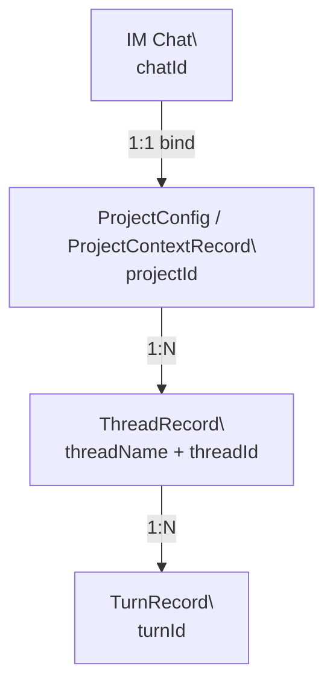

# 核心类：Project / Thread / Turn

最新版代码里，最核心的三个对象不是按平台拆分，而是按协作主轴拆分：

- `Project` 负责聚合根和项目级配置
- `Thread` 负责一次持续协作会话
- `Turn` 负责线程中的单次执行

这三个对象共同构成系统的最小稳定骨架。


> Placeholder：在这里插入 `Project / Thread / Turn` 关系图，建议额外标出 `UserThreadBinding` 和 `RuntimeConfig`。

## 三者关系



## 1. Project

`Project` 在代码里的落点主要是两种投影：

| 类型 | 位置 | 作用 |
| --- | --- | --- |
| `ProjectRecord` | `services/project/project-types.ts` | 持久化项目配置，是真正的项目聚合根 |
| `ProjectResolver` | `services/project/project-resolver.ts` | orchestrator 视角下的 `chatId -> projectId` 解引用契约 |

### Project 的职责

| 职责 | 说明 |
| --- | --- |
| 聚合根 | thread / turn / snapshot / user-thread-binding 最终都归属到 `projectId` |
| 平台绑定 | `chatId` 只是 Project 的 1:1 平台绑定 |
| 运行时默认配置 | 保存 `cwd`、`defaultBranch`、`sandbox`、`approvalPolicy` 等项目级配置 |
| 路由起点 | 所有 IM 入口先做 `chatId -> projectId` 解引用 |

### Project 的关键字段

| 字段 | 说明 |
| --- | --- |
| `id` | `projectId`，系统内部主键 |
| `chatId` | IM 平台绑定，不是 thread/turn 的真实持久化主键 |
| `cwd` | 项目工作目录 |
| `defaultBranch` | 默认分支 |
| `sandbox` | sandbox 策略 |
| `approvalPolicy` | 审批策略 |
| `status` | 项目启用状态 |

### Project 的不变式

- Project 是聚合根，不能用 `chatId` 直接替代 `projectId`
- 线程历史不跟随群聊迁移；重新绑群时只更新 Project 与 Chat 的绑定
- orchestrator 进入领域逻辑前，必须先经 `ProjectResolver.findProjectByChatId(chatId)`

## 2. Thread

`Thread` 在代码中由 `ThreadRecord` 表示，定义位于 `services/thread/types.ts`，注册接口位于 `services/thread/thread-registry.ts`。

### Thread 的职责

| 职责 | 说明 |
| --- | --- |
| 协作主轴 | 表示一个持续存在的分支/会话/任务线 |
| 绑定后端身份 | 保存 `BackendIdentity`，决定该线程走哪个 backend |
| 绑定后端会话句柄 | `threadId` 是后端分配的 opaque handle |
| 承接 turn 序列 | 一个 thread 下会持续生成多个 turn |

### Thread 的关键字段

| 字段 | 说明 |
| --- | --- |
| `projectId` | 所属项目 |
| `threadName` | 项目内逻辑线程名 |
| `threadId` | 后端线程 ID / 会话 ID |
| `backend` | 不可拆分的 `BackendIdentity` |

### Thread 的不变式

- `ThreadRecord.backend` 是线程后端身份的唯一真实来源
- backend 信息必须原子传递，不能拆成 `model + transport + backendName`
- 线程创建后 backend 身份不可修改
- `UserThreadBinding` 只能指向 thread，不能复制 backend 元数据

## 3. Turn

`Turn` 在代码中由 `TurnRecord` 表示，定义位于 `services/turn/types.ts`，兼容 re-export 位于 `services/turn/turn-record.ts`。

### Turn 的职责

| 职责 | 说明 |
| --- | --- |
| 单次执行单元 | 表示用户发起的一次 agent 执行 |
| 串联流式状态 | 承接运行中、待审批、完成、失败等状态变化 |
| 记录执行结果 | 保存 diff、token usage、最后一条 agent 消息、完成时间等 |
| 提供审计基础 | 是 snapshot、审批、恢复、历史查询的主索引之一 |

### Turn 的关键字段

| 字段 | 说明 |
| --- | --- |
| `projectId` | 所属项目 |
| `threadName` / `threadId` | 所属线程 |
| `turnId` | 本次执行 ID |
| `status` | `running` / `awaiting_approval` / `completed` / `accepted` / `reverted` / `interrupted` / `failed` |
| `cwd` | 本次执行工作目录 |
| `approvalRequired` | 是否进入审批 |
| `filesChanged` / `diffSummary` | 变更摘要 |
| `tokenUsage` | token 消耗 |
| `createdAt` / `updatedAt` / `completedAt` | 生命周期时间点 |

### Turn 的不变式

- Turn 永远挂在 Thread 之下，不直接挂在 Chat 之下
- turn 查询、恢复、快照都应以 `projectId` 为持久化归属
- turn 状态推进通过 orchestrator 和事件管线完成，不能绕过主路径直接写平台层

## 核心数据流

```text
IM Event
  -> chatId
  -> ProjectResolver.findProjectByChatId(chatId)
  -> projectId
  -> ThreadRegistry.get(projectId, threadName)
  -> ThreadRecord.backend / ThreadRecord.threadId
  -> 创建或恢复 TurnRecord
  -> backend 执行与事件回写
```

```ts
const project = projectResolver.findProjectByChatId(chatId);
const thread = threadRegistry.get(project.id, threadName);
```

## 为什么这三个对象最核心

| 对象 | 没有它会发生什么 |
| --- | --- |
| `Project` | 无法确定聚合根，`chatId` 会重新污染持久化主键 |
| `Thread` | 无法稳定绑定 backend 身份和会话恢复 |
| `Turn` | 无法承载单次执行、审批状态和历史审计 |

## 与其他对象的关系

| 对象 | 与三大核心类的关系 |
| --- | --- |
| `BackendIdentity` | Thread 的不可变后端身份值对象 |
| `UserThreadBinding` | 用户维度的 thread 指针，不属于核心聚合根 |
| `RuntimeConfig` | 每个 turn 执行前临时组装，来源于 Project + Thread |
| `UnifiedAgentEvent` | Turn 执行中在 Path B 上传播的统一事件模型 |
